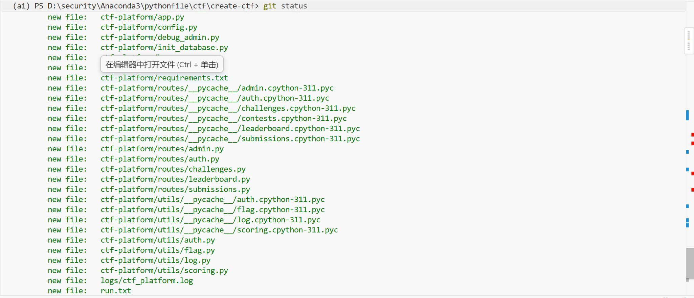
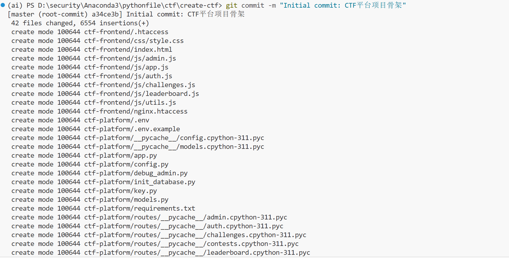
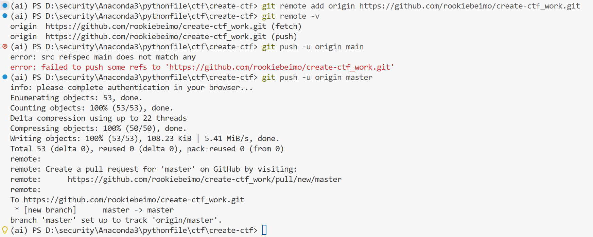
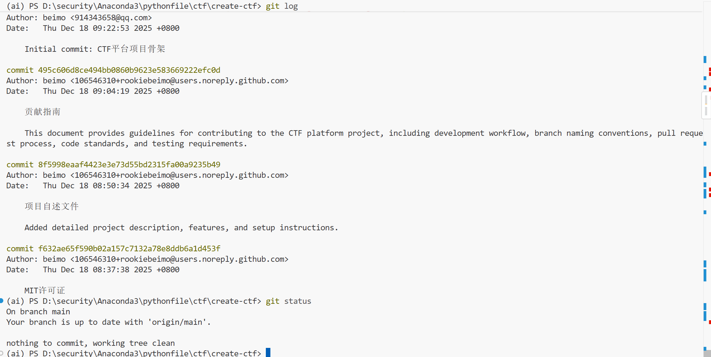
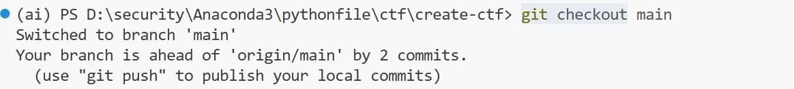
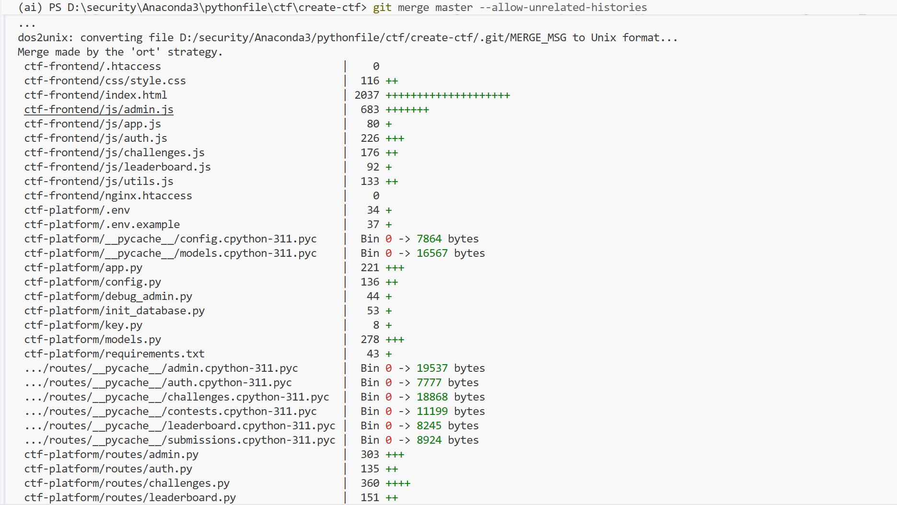

1. 本项目所有显著变更都将记录在此文件中。
   格式遵循 [Keep a Changelog](https://keepachangelog.com/)，版本号遵循 [Semantic Versioning](https://semver.org/)。

   ## [未发布]

   *（此版本正在开发中）*

   ### Added

   ### Changed

   ### Fixed

   ------

   ## [1.1.0] - 2023-10-26

   *（规划中的下一版本）*

   ### Added

   ### Changed

   ### Fixed

   ------

   ## [1.0.0] - 2023-10-15

   ### 正式发布：CTF平台基础框架

   这是CTF（Capture The Flag）网络安全竞赛平台的首次正式发布，包含完整的前后端基础架构和核心功能模块。

   ### 🚀 核心新增功能

   #### 后端模块 (`ctf-platform/`)

   - **应用入口**：`app.py` - Flask主应用，集成CORS，支持多环境配置
   - **数据模型**：`models.py` - 用户(User)、题目(Challenge)、提交(Submission)、分类(Category)、系统日志(SystemLog)的完整ORM模型
   - **配置管理**：`config.py` - 开发/测试/生产多环境配置，支持MySQL、Redis、邮件服务等
   - **认证系统**：`utils/auth.py` - JWT Token认证中间件与权限装饰器
   - **题目系统**：
     - `routes/challenges.py` - 题目CRUD、Flag提交验证、分类管理
     - `utils/flag.py` - Flag生成、验证、哈希存储工具
     - `utils/scoring.py` - 动态积分计算系统（基于难度、解题人数、时间衰减）
   - **管理系统**：
     - `routes/admin.py` - 管理员仪表板、用户管理、题目管理、数据统计
     - `routes/submissions.py` - 提交记录查询与统计
   - **排行榜系统**：`routes/leaderboard.py` - 全球排行、分类排行、题目排行
   - **日志系统**：`utils/log.py` - 分级日志记录，支持安全事件、提交记录、管理员操作追踪
   - **数据库工具**：`init_database.py` - 数据库初始化脚本，创建默认分类和管理员账户
   - **依赖管理**：`requirements.txt` - 完整的Python依赖清单

   #### 前端模块 (`ctf-frontend/`)

   - **单页应用架构**：`index.html` - 基于Bootstrap 5的响应式SPA应用
   - **核心样式**：`css/style.css` - 平台UI样式与组件设计
   - **应用框架**：`js/app.js` - 主应用逻辑与页面路由
   - **工具模块**：`js/utils.js` - API请求封装、消息提示、格式处理等工具函数
   - **功能模块**：
     - `js/auth.js` - 用户注册、登录、状态管理
     - `js/challenges.js` - 题目列表、详情展示、Flag提交
     - `js/leaderboard.js` - 排行榜数据展示与筛选
     - `js/admin.js` - 管理员后台管理界面
   - **部署配置**：`.htaccess`, `nginx.htaccess` - Web服务器配置文件

   ### 📁 配置文件

   - `.env.example` - 环境变量配置模板
   - `key.py` - 密钥配置文件
   - `debug_admin.py` - 管理员调试工具

   ### 🔧 技术特性

   - **前后端分离**：RESTful API + 前端SPA架构
   - **安全设计**：JWT认证、密码哈希、SQL注入防护
   - **动态评分**：基于解题情况自动调整题目分值
   - **多环境支持**：开发、测试、生产环境一键切换
   - **完整日志**：操作日志、安全日志、系统日志三级记录体系

   ------

   ## Git版本管理操作记录

   ### 关键Git命令使用示例

   #### 1. 添加文件与状态检查 (`git add`, `git status`)

   **使用场景**：将工作目录中的更改添加到暂存区，准备提交。

   ```
   # 添加所有更改的文件
   git add .
   
   # 查看当前仓库状态（显示已暂存、未跟踪的文件）
   git status
   ```

**典型输出**：




#### 2. 提交更改 (`git commit`)

**使用场景**：将暂存区的更改创建为一个新的版本记录。

```
# 提交更改并添加描述信息
git commit -m "Initial commit: CTF平台项目骨架"
```

**命令说明**：`-m` 参数后跟提交信息，应清晰描述本次更改的内容。这是项目的首次提交，包含了前后端所有基础框架文件。



#### 3. 推送到远程仓库 (`git push`)

**使用场景**：将本地提交同步到远程仓库（如GitHub）。

```
# 首次推送并设置上游跟踪分支
git push -u origin main

# 后续推送（已设置跟踪后）
git push
```

**命令说明**：`-u origin main` 设置本地`main`分支跟踪远程`origin/main`分支，后续可直接使用`git push`简化操作。



#### 4. 查看提交历史 (`git log`)

**使用场景**：查看项目的版本历史记录。

```
# 简洁的单行格式查看
git log --oneline

# 图形化查看分支合并历史
git log --oneline --graph --all
```

**典型输出**



#### 5. 分支管理与合并 (`git checkout`, `git merge`)

**使用场景**：创建、切换分支并合并不同开发线。

```
# 切换回主分支
git checkout main

# 合并其他分支到当前分支
git merge master --allow-unrelated-histories
```





### 项目Git时间线

1. **初始提交** (`a34ce3b`) - "Initial commit: CTF平台项目骨架"
   - 包含了CTF平台的完整基础代码结构
   - 前后端分离架构，模块清晰
2. **文档完善** (`495c606`, `8f5998e`, `f632ae6`等)
   - 添加项目文档：README、贡献指南、许可证
   - 建立项目规范和协作流程
3. **分支合并** (`520e80d`) - "Merge branch 'master'"
   - 将独立开发的`master`分支（代码骨架）合并到`main`分支（文档主线）
   - 形成完整的项目代码库

### ⚠️ 重要操作注意事项

1. **提交信息规范**：使用清晰、一致的提交信息格式，便于追溯更改历史
2. **分支策略**：采用`main`作为稳定主分支，新功能在独立分支开发
3. **合并时机**：确保代码经过测试后再合并到主分支
4. **远程同步**：定期`git pull`更新本地仓库，避免合并冲突